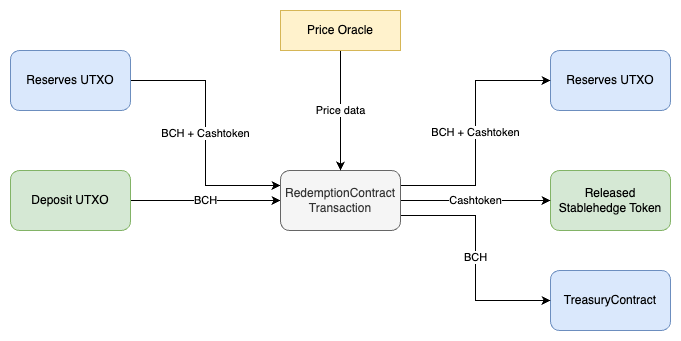
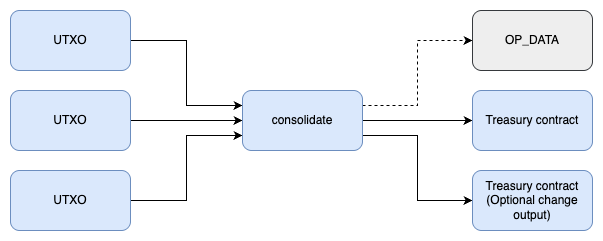

# StableHedge: Decentralized Stability Solution for Bitcoin Cash Through Tokenized Hedging and Dynamic Treasury Management

Jeff Khirvy Kyell Sarmen and Joemar Taganna

stablehedge@paytaca.com

www.paytaca.com

Whitepaper version: v0.1.0

Last update: February 13, 2025


## Abstract
StableHedge is a novel DeFi protocol built on the Bitcoin Cash (BCH) blockchain, designed to mitigate price volatility risks while enabling instant liquidity. By tokenizing AnyHedge [1] contracts and integrating strategic hedging via BCH Bull, StableHedge offers a stable, redeemable token pegged to USD value, eliminating lock-in periods and reducing counterparty fees. This whitepaper outlines the architecture, mechanics, and benefits of StableHedge, positioning it as a transformative solution for BCH users and merchants.

## 1. Introduction
Bitcoin Cash (BCH) offers fast, low-cost transactions making it an ideal option for peer-to-peer payments. However price volatility hinders its adoption for everyday transactions.

Existing solutions like AnyHedge and BCH Bull allow users to lock in the value of their asset through hedging or speculate through long positions on price movements [1]. While these platforms provide an effective solution to mitigate volatility, they suffer from inflexible lock-in periods and premium fees.

StableHedge addresses these limitations by combining tokenization, decentralized hedging, and dynamic treasury management to create a stable, liquid asset for BCH holders.

## 2. Problem Statement
#### Volatility Exposure
Cryptocurrencies, such as Bitcoin Cash, exhibit significantly higher price volatility compared to traditional assets like fiat currencies. These fluctuations can result in lower value of the asset which discourages widespread adoption among merchants and users as a form of payment or store of value.
#### Lock-In Periods
Existing solutions, such as AnyHedge, provide volatility protection through hedging mechanisms in which users lock BCH into a smart contract with a counterparty willing to assume the volatility risk. However, this approach restricts immediate access to funds, as they remain locked until the contract reaches its predetermined expiration.
#### Premium Fees
Counterparties charge fees (premiums) to offset risk. High premiums may be imposed by the counterparty on unfavorable market conditions.

## 3. Solution: StableHedge Architecture
Our proposed solution, **Stablehedge**, seeks to address the aforementioned challenges by leveraging SmartContracts, dynamic hedging through tokenization, and employing a dynamic treasury management strategy utilizing AnyHedge's leveraged short positions. Shown below is an overview of proposed platform’s architecture:

<figure>
  
  <figcaption>Figure 1: StableHedge Architecture</figcaption>
</figure>

- The **RedemptionContract** serves as a liquidity pool facilitating the deposit and redemption of Bitcoin Cash (BCH) in the platform.

- The **TreasuryContract** receives a portion of the BCH received during deposit where it will be used in a 2x leveraged short position.

- The **2x short contract** is an Anyhedge smart contract placed in the BCH Bull platform. After its maturity or liquidation is met, the payout BCH returns back to the TreasuryContract.

- The **PriceOracle** provides price data for the contracts outlined above. This data is sourced from General Protocol's PriceOracle, which delivers cryptographically signed price messages to ensure data integrity and authenticity.

### 3.1 Tokenization of Deposits

StableHedge utilizes fungible CashTokens [3], StableHedge tokens, to represent the BCH deposited in the platform. The value of these tokens is pegged to an external asset (e.g., USD) relative to BCH.

To stabilize their funds, users deposit BCH into the StableHedge platform. In return, they receive Stablehedge tokens, which represent their deposited funds. The number of tokens issued is determined by the deposited BCH amount and the latest price of the external asset which is provided by the PriceOracle.

### 3.2 Fund Allocation
During deposits, the BCH sent by the users are distributed equally to two contracts used for different purposes.

- **RedemptionContract**: The BCH deposited into this smart contract serves as liquidity for redemption, ensuring that users are able to access their funds when needed.

- **TreasuryContract**: The remainder is accumulated until a threshold (e.g., 1 BCH) is met. Upon reaching this threshold, the accumulated BCH is placed into a 2x leveraged short position on BCH Bull.

### 3.3 Hedging Mechanism

The funds stored in the TreasuryContract are used to ensure that the total deposit BCH in the platform is able to back the total issued stablehedge tokens at 1:1 value against the external asset.

This is achieved by placing 2x leveraged shorts in the BCH Bull platform using the BCH accumulated in the TreasuryContract. Leveraged shorts result in an increase in payout in the case of price drops while a decrease in payout in the case of price increase. This behavior is also observed in a simple hedge but with magnified effects on price changes [2].

### 3.4 Redemption Process

Redemption of BCH allows users to access the funds they have deposited to the platform. Users can redeem their funds by using the stablehedge tokens issued to them during deposit. The stablehedge tokens return back to the platform while the user receives BCH based on the amount of stablehedge tokens used and the latest price of the external asset which is provided by the PriceOracle.

Since only a portion of deposited funds are allocated as liquidity for redemption, the amount of redeemable BCH may be limited when liquidity is low.

## 4. Implementation

### 4.1 Definitions and Notations

- **Reserves UTXO**: Bitcoin Cash uses an Unspent Transaction Output (UTXO) model and one of its notable features is the ability to hold both BCH and Cashtokens in a single UTXO. We make use of this feature to simplify the management of liquidity for deposit and redemption. We do this by storing the liquidity in RedemptionContract using a single UTXO called Reserves UTXO.

- **Bitcoin Cash (BCH) Amounts**: All BCH values are represented in satoshis, where 1 BCH equals 100,000,000 satoshis.

- **Token Amounts**: Each token has a unit defined by its decimal precision. For this paper, we will declare a fungible token, shUSD, with 2 decimal places where 1 shUSD = 100 token units.

- **Price Value**: All price values are expressed in assets per BCH. For instance, USD prices are in USD/BCH meaning the price represents the amount of USD for 1 BCH. Price values also have decimal precisions, for instance USD/BCH are represented as USD cents per BCH where 1 USD = 100 USD cents. For 1 USD/BCH, the price value used in calculations is 100 USD cents / BCH.

- **Total Value Locked**: The total value locked (TVL) is the total amount of funds stored in the platform. This includes the BCH held in RedemptionContract and TreasuryContract and the total value, in BCH, of the ongoing short positions.

### 4.2 Conversions

The Bitcoin Cash script operates without floating-point arithmetic, making division operations result in floor division. To maintain consistency with this behavior, we derived the following two formulas for converting between satoshis and token units.

Equation 1: Satoshis to Token units
```
tokenUnits = ⌊(satoshis * priceValue) / satsPerBch)⌋
```
Equation 2: Token units to Satoshis
```
satoshis = ⌊(tokenUnits * satsPerBch) / priceValue)⌋
```

Where:
- *tokenUnits* - Token amount in units
- *satsPerBch* - A constant 10,000,000
- *priceValue* - Price value in units per BCH (e.g. USD cents per BCH)

### 4.3 Smart Contracts

The smart contracts are designed to implement a semi-managed non-custodial framework, ensuring that while the platform retains some level of control over treasury operations, users maintain custody of their assets. This design grants the treasury contract flexibility in the timing of placing short positions while imposing constraints on fund utilization. Specifically, we aim to restrict them to two types of recipients; the leveraged short positions and the redemption contract.

#### RedemptionContract

The RedemptionContract is a CashScript smart contract designed for handling and managing liquidity for the platform. The contract uses signed price oracle messages to enforce the correct values in deposit and redemption. The contract also uses the AuthGuard standard [4] for managing liquidity funds. The parameters of the contract are as follows:
- *authKeyId (bytes32)*: The 32-byte token category representing the NFT that grants authentication to manage the contract's funds.
- *tokenCategory (bytes32)*: A 32-byte token category of a stablehedge token.
- *oraclePublicKey (pubkey)*: A 33-byte public key used to verify price messages from an oracle.

The source code of the contract is provided [here](./contracts/redemption-contract.cash).

#### TreasuryContract

The TreasuryContract is a CashScript smart contract designed to manage treasury funds and provide the funds for leveraged shorts using 3-of-5 multisignature and the AuthGuard standard [4]. The contract’s parameters are as follows:

- *authKeyId (bytes32)*: A 32-byte token category representing the NFT required for unlocking treasury funds.
- *pk1, pk2, pk3, pk4, pk5 (pubkey)*: Five 33-byte public keys associated with the treasury's multi-signature scheme.
- *anyhedgeBaseBytecode (bytes)*: Base bytecode of the anyhedge smart contract. Used for generating the recipient address when funding short positions.

The source code of the contract is provided [here](./contracts/treasury-contract.cash).

### 4.4 Deposit Transaction

<figure>
  
  <figcaption>Figure 2: Deposit transaction</figcaption>
</figure>

A deposit transaction is a RedemptionContract covenant that expects 2 inputs and 3 inputs (see Figure 2 above):

#### Inputs
- Input 0 - The *Reserves UTXO*.
- Input 1 - The *Deposit UTXO* provided by the user which contains the amount of BCH to lock with an additional 2000 satoshis for the Cashtoken output dust and the transaction fee.
#### Outputs
- Output 0 - Return *Reserves UTXO*, half of the deposit BCH is added to this output while the stablehedge token is deducted based on the deposit BCH and price value provided.
- Output 1 - Released stablehedge token output. The amount must be equal to the stablehedge token deducted from the *Reserve UTXO*
- Output 2 - The other half of the deposit BCH is sent to the TreasuryContract.

To determine the amount of satoshis needed in the *Deposit UTXO*, we use Equation (2)

Example: A deposit worth 20 shUSD at 100USD/BCH will need 0.20002 BCH

```
satoshis = ⌊(tokenUnits * satsPerBch) / priceValue)⌋
	     = ⌊(2,000 * 10^8) / 10,000)
	     = ⌊200,000,000,000 / 10,000⌋
	     = ⌊20,000,000⌋
	     = 20,000,000 satoshis
```

An additional 2000 satoshis dust amount and transaction fee

```
	     = 20,000,000 + 2000
	     = 20,002,000 satoshis
	     = 0.20002 BCH
```

### 4.5 Redemption Transaction

<figure>
  
  <figcaption>Figure 3: Redeem transaction</figcaption>
</figure>

A redeem transaction has 2 inputs and 2 outputs (see Figure 3 above):

#### Inputs

- Input 0 - *Reserves UTXO*
- Input 1 - The *Redeem UTXO* provided by the user which contains the exact amount of stablehedge tokens to redeem. The BCH value in this UTXO is used as the transaction fee.

#### Outputs
- Input 0 - Return *Reserves UTXO*, the stablehedge tokens from the *Redeem UTXO* is added to this output while the BCH amount is deducted based on the redeemed tokens and price value provided.
- Output 0 - Redeemed BCH output. The BCH contained must be equal to the BCH deducted from the Reserves UTXO.

To determine the amount of BCH redeemed, we use Equation (2).

Example: A deposit worth 20 shUSD at 200USD/BCH will return 0.20002 BCH
```
satoshis = ⌊(tokenUnits * satsPerBch) / priceValue​⌋
	     = ⌊(2,000 * 100,000,000) / 20,000⌋
	     = ⌊200,000,000,000 / 20,000⌋
	     = ⌊10,000,000⌋
	     = 10,000,000 satoshis
	     = 0.1 BCH
```


### 4.6 Leveraged short

Treasury funds are placed in a 2x leveraged short contract with BCH Bull. We limit the amount to short based on the TVL to ensure that there is enough funds for rebalancing.

For funding the short contract, TreasuryContract contains a covenant, `spendToAnyhedge`, to ensure that the funds are sent to an Anyhedge contract. This is achieved by generating recipient address using the anyhedge artifact bytecode from `anyhedgeBaseBytecode` parameter and short position parameters. Additionally, constraints are enforced on the short position parameters and the funding transaction inputs to prevent disadvantage on TreasuryContract when placing the short position. 

We added a covenant, `consolidate`, to generate the UTXO that has the exact amount needed for the short position's funding transaction. Furthermore, by limiting the funding to a single UTXO, the complexity is reduced in the covenant `spendToAnyhedge`. An example of a consolidate function is shown below.

<figure>
  
  <figcaption>Figure 4: Consolidate transaction</figcaption>
</figure>

- Every 4 bytes in `OP_DATA` contains the cumulative satoshis of the UTXOs provided in the inputs, resulting in the last 4 bytes as the total input satoshis.
- Each input check's if the adjacent and active indices are from the TreasuryContract. This condition ensures that all inputs are from the TreasuryContract and that the data in `OP_DATA` above is true.
- There is a fixed number of 1-2 outputs that returns to the TreasuryContract. An optional 2nd output is provided as change output to allow creating a UTXO with a specific amount of satoshis. This is required for funding short positions.
- Having a fixed number of outputs allows us to determine the total output satoshis. This can be compared with the last 4 bytes of `OP_DATA`, which is the total input satoshis. By comparing these values, we prevent burning a significant amount of satoshis from improperly balancing input and output amounts.

### 4.7 Rebalancing

The platform maintains liquidity redemption by ensuring there is equal value locked between RedemptionContract & TreasuryContract. We add a process where a portion of the funds from the TreasuryContract are allocated to the RedemptionContract’s ReserveUTXO using authkey token for each contract.

The TreasuryContract sends BCH to the RedemptionContract then the RedemptionContract re-arranges its funds by combining the received BCH to the ReserveUTXO. In cases where the RedemptionContract and TreasuryContract shares the same authkey token, these two steps can be done in a single transaction to reduce transaction fees.

## 5. Key Innovations

#### No Lock-In Periods
BCH deposited by users are not entirely locked or inaccessible for a fixed period, making them available for everyday transactions.

#### Reduced Fees
Users are not exposed to premiums set by counterparties for stabilizing their funds. The additional fees considered by the user are only for transaction fee and dust amount for token output during deposit. The dust from the RedeemUTXO is used as transaction fees requiring no additional transaction fees during redemption.

#### Stability
The 2x leveraged shorts ensures that the total BCH deposited maintains its value pegged to the external asset. As shown in the figure below, a decrease in price causes TreasuryContract funds value to increase, covering for the devaluation of funds in the RedemptionContract. On the other hand, an increase in price causes TreasuryContract funds value to decrease while the value of funds in the RedemptionContract appreciate.

<figure>
  
  <figcaption>Figure 5</figcaption>
</figure>


#### Liquidity
The price changes affect the value of the BCH in the TreasuryContract and RedemptionContract, resulting in an imbalance of fund allocation between them. For instance, a price drop will reduce the value of BCH in RedemptionContract while the value of BCH in the TreasuryContract increases. In this case, the gains from the TreasuryContract’s leveraged shorts can be allocated to the RedemptionContract to maintain a balance of allocation of funds and maintain liquidity.

## 6. Risk Management

#### Redemption Buffer
The 50% redemption pool assumes non-simultaneous withdrawals, typical in stablecoin models. This allows its users to be able to access their funds when needed while allowing the platform to manage risks especially during price drops.

#### Leverage Limits
By splitting funds between a redemption buffer and 2x leveraged shorts, the platform avoids putting all its funds at the risk of overexposure. The allocation between these funds mitigate the impact during price movements.

#### Volatility Scenarios
The role of the redemption buffer and leveraged funds reduce the unfavorable effects of the other when the price changes. In the case of price drops, leveraged short results in gains which offset the devaluation of the funds in the redemption buffer. On the other hand, a price increase results in losses for the leveraged shorts but the funds in the redemption buffer appreciate from the price change. 


## 7. Use Cases

#### Merchants
Merchants can protect their sales from the risk of volatility while benefiting from the fast transaction speeds and low fees that are already offered in Bitcoin Cash. It may also encourage new merchants to accept BitcoinCash as payments who are concerned about the volatility issue.

#### Investors
Investors can hold stablecoins as a stable store of value, providing a hedge against market volatility and economic uncertainty. They can also diversify their portfolios, access cross-border investment opportunities, and preserve capital during market downturns.

#### Traders
Traders can capitalize on price changes through reverse arbitrage. This allows them to realize gains in BCH while minimizing effects of volatility.

## 8. Benefits Over AnyHedge/BCH Bull

#### Flexibility
Deposited BCH are not locked in the platform for a fixed period. Users’ funds are protected from volatility while remaining accessible for everyday transactions.

#### Cost Efficiency
Users are not exposed to premiums set by counterparties as it is included in the treasury’s funds. Premium costs are balanced by the treasury's gains from leveraged short positions, which are generated when the price declines. Additionally, aggregating BCH in the TreasuryContract before initiating leveraged short positions leads to fewer but larger trades, minimizing transaction fees compared to executing multiple smaller short positions.

#### User Experience
Simplified tokenized interface vs. manual contract management. There is minimal interaction required between the user and platform as there is no need to consider lock-in periods and liquidation parameters in stabilizing funds.

## 9. Challenges & Mitigations

#### Mass Redemptions
Sudden price changes may result in liquidation of leveraged shorts and trigger rebalancing of funds between redemption buffer and treasury funds. The redemption buffer acts as a safety net, preventing the platform from becoming overexposed to sudden liquidity demands and helping it manage mass redemption in unfavorable conditions.

#### Market Liquidity
Partnerships with BCH Bull ensure sufficient liquidity for creating large short positions. An increase in volume would increase in liquidity, ensuring users’ funds remain accessible for everyday transactions.

## 10. Conclusion

StableHedge provides a stability solution for BCH-based DeFi by merging tokenization, decentralized hedging, and algorithmic treasury management. By addressing lock-ins, fees, and volatility, it enhances BCH’s usability for payments and savings. StableHedge helps bridge the gap between crypto volatility and real-world financial stability, supporting broader adoption of Bitcoin Cash.

## References
[1] imaginary_username, J. Nieri, and J. Silverblood, "AnyHedge: A Decentralized Hedge Solution against Arbitrary Assets on Bitcoin Cash," General Protocols, 2020. [Online]. Available: https://anyhedge.com/downloads/AnyHedge%20Whitepaper.pdf

[2] General Protocols, “Understanding The BCHBull Contract” BCHBull.com [Online]. Available: https://bchbull.com/thecontract [Accessed: Feb 5, 2025]

[3] J. Dreyzehner, "Token Primitives for Bitcoin Cash," Bitjson's Blog, Feb. 22, 2022. [Online]. Available: https://cashtokens.org/docs/spec/chip/ [Accessed: Feb. 5, 2025].

[4] M. Geukens, bitcoincashautist, “AuthGuard Standard”, November 14, 2023. [Online]. Available: https://github.com/mr-zwets/AuthGuard/ [Accessed: February 13, 2025].
